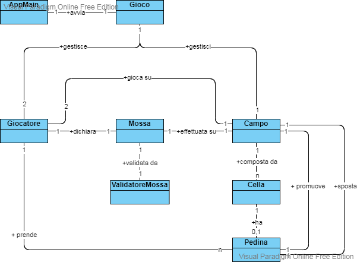
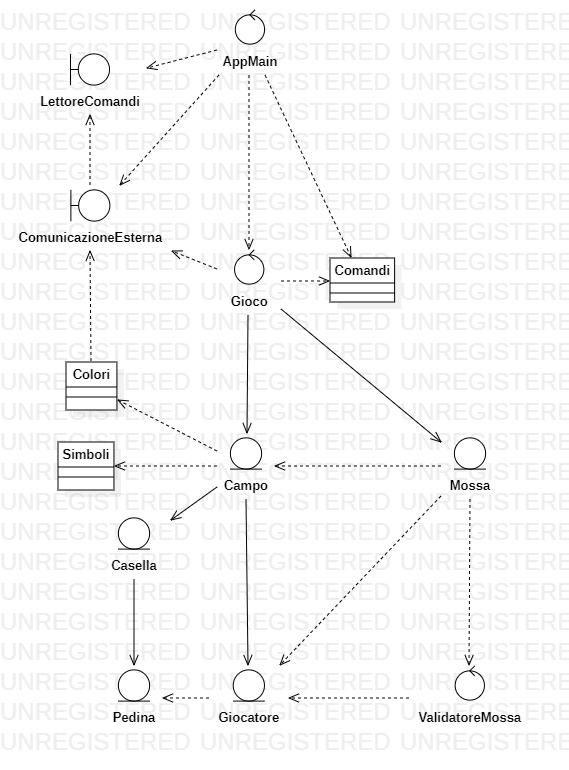

# Documento tecnico finale
## Introduzione
il seguente documento è la relazione tecnica del gioco di Dama italiana, creato per il corso Ingegneria Del Software per l'AA. 2020-2021 dal gruppo vijayashanker. 
Si ringraziano per la collaborazione nel gruppo:
[Christian Giacovazzo](https://github.com/Christian-is),
[Simone Capone](https://github.com/scapone1997),
[Ivan Digioia](https://github.com/IvanDigioia),
[Thomas Carella](https://github.com/ThomasCarella),
[Simone De Girolamo](https://github.com/simone5138),

## Modello di dominio

## Requisiti specifici
I requisiti specifici si dividono in requisiti funzionali e non-funzionali

### Requisiti funzionali
I seguenti requisiti funzionali derivano dalle _User stories_ usate durante la realizzazione del programma. una piccola descrizione è stata aggiunta per descrivere il funzionamento.

- _Come giocatore voglio iniziare una nuova partita_
	- Al comando `gioca`,se nessuna partita è in corso, l'app si predispone a ricevere la prima mossa di gioco o altri comandi.
- _Come giocatore voglio mostrare l'help con elenco comandi_
	- Al comando `help` o eseguendo l'app con il flag `--help` o `-h`, appare una lista di comandi che si possono usare nell'applicazione.
- _Come giocatore voglio mostrare la damiera con la numerazione in modo da ricordare come sono numerate le caselle della damiera_
	- Al comando `numeri`, l'app mostra la damiera con i numeri sulle caselle nere.
- _Come giocatore voglio mostrare la damiera con i pezzi in modo da visualizzare lo stato del gioco_
	- Al comando `damiera`, se una partita è stata avviata, l'app mostra la posizione di tutti i pezzi sulla damiera.
- _Come giocatore voglio iniziare una nuova partita_
	- Al comando `gioca`, se nessuna partita è stata avviata, l'app permette di creare una nuova partita e si predispone a ricevere la prima mossa del gioco.
- _Come giocatore voglio abbandonare la partita_
	- Al comando `abbandona`, se una partita è stata già avviata, l'app consente di scegliere se abbandonare o meno la partita, e, in caso positivo, la vittoria è assegnata all'avversario.
- _Come giocatore voglio chiudere il gioco_
	- Al comando `esci`, l'applicazione consente di scegliere se uscire dal gioco o meno, e in caso positivo, il programma è terminato
- _Come giocatore voglio mostrare il tempo di gioco_
	- Al comando `tempo`, se una partita è stata già avviata, l'app mostra il tempo trascorso per entrambi i giocatori.
- _Come giocatore voglio spostare una pedina mediante spostamento semplice_
	- A partita avviata, l'app accetta le mosse di spostamento di una pedina in formato `n-n` in notazione algebrica (dove `n` indica la casella da/in cui si vuole spostare la pedina)
- _Come giocatore voglio spostare una pedina con presa semplice_
	- A partita avviata, l'app accetta le mosse di presa di una pedina avversaria in formato `nxn` in notazione algebrica (dove `n` indica la casella da/in cui si vuole spostare la pedina).
- _Come giocatore voglio spostare una pedina con presa multipla_
	- A partita avviata, l'app accetta le mosse di presa di una pedina avversaria in formato `nxnxn` (dove `n` indica la casella da/in cui si vuole spostare la pedina). Nota: non c'è un limite al numero di prese multiple oltre a quello imposto dal regolamento di gioco.
- _Come giocatore voglio visualizzare le mosse giocate in modo da poter ripercorrere mentalmente la storia della partita giocata_
	- Al comando `mosse`, se una partita è stata già avviata, l'app mostra le mosse giocate in modo da poter ripercorrere la storia della partita giocata.
- _Come giocatore voglio visualizzare le prese in modo da valutare se è il caso di offrire una patta o abbandonare_
	- Al comando `prese`, se una partita è stata già avviata, l'app mostra le prese di entrambi i giocatori effettuate durante la partita.

### Requisiti non funzionali
- <u>RNF1:</u> Il programma è stato diviso in classi in base alle loro funzionalità per consentire una facile manutenzione
- <u>RNF2:</u> Il programma è raggruppato in pacchetti per gestire al meglio l'interoperabilità delle classi
- <u>RNF3:</u> Il programma possiede interfacce di input e output isolate rispetto alla realizzazione dell'applicazione
- <u>RNF4:</u> Il programma è avviabile su Docker per consentire maggiore portabilità

## System design
Durante lo sviluppo del progetto, non sono state prese decisioni riguardo alla scelta di un particolare design. L'unica decisione per il design è stata dividere le diverse classi per rispettare lo schema ECB, trattando come classi entity tutte le classi che possono funzionare in maniera indipendente, separandole da ciò che gestisce la logica del programma.
## OO design
Seguono i diagrammi delle classi e i diagrammi di sequenza per alcune delle user story più importanti all'interno del progetto.

Per soddisfare il paradigma OO all'interno del progetto, è stato rispettato il principio di _information hiding_, facendo in modo che solo le operazioni strettamente necessarie per il funzionamento del programma siano pubbliche e con una implementazione visibile (come ad esempio le classi _boundary_ che si occupano di interfacciarsi con l'utente), mantenendo il resto dell'implementazione dei metodi, se possibile, nascosti.
Gli altri principi rispettati per l'OO design sono:
- Alta coesione
> _Le componenti hanno responsabilità ben definite_

	Ogni classe è stata progettata per effettuale uno specifico ruolo (basandosi anche sulla tassonomia ECB). 

- Basso accoppiamento
> _Le componenti hanno responsabilità assegnate in modo da limitare ripercussioni di eventuali cambiamenti_

	Avendo rispettato il principio di Information Hiding, I metodi delle classi sono stati implementati in modo da avere il minore impatto possibile in caso di cambiamenti sul codice.
- Presentazione separata
> _la parte di codice relativa alla presentazione deve essere tenuta separata dal resto dell’applicazione_

	sfruttando la tassonomia ECB (entity-control-boundary), sono state divise le diverse classi in modo da mantenere separate le interfacce con cui l'utente interagisce, rispetto alla porzione di codice che si occupa di elaborare i dati in input e verificare che siano corretti.
- Do not Repeat Yourself 
> _Ogni parte significativa di una funzionalità deve avere una sola rappresentazione all'interno del sistema_

	 Le classi del programma (come ad esempio le classi che contengono unicamente attributi statici) sono state create appositamente per evitare ripetizioni di codice che possono creare problemi in caso di modifiche.

Il risultato di queste scelte di progettazione è visibile all'interno del diagramma delle classi

Seguono alcuni esempi di sequenza di alcune delle _user stories_ più importanti all'interno del progetto:
- Spostamento semplice
	> .png)

- Spostamento semplice con damatura
	> .png)

- Registra mossa
	> .png)

- Presa semplice
	> .png)

- Presa semplice (con damatura)
	> .png)

- Registra prese (bianco)
	> .png)

- Registra prese (nero)
	> .png)

## Riepilogo dei test
Di seguito sono riportati i risultati dei test:
- [CheckStyle main](reports_screen/checkstyle_main.png)
- [Checkstyle test](reports_screen/checkstyle_test.png)
- [SpotBugs main](reports_screen/spotbugs_main.png)
- [SpotBugs test](reports_screen/spotbugs_test.png)
- [Jacoco report](reports_screen/jacocoTestReport.png)

Per quanto riguarda i test dei metodi, questi sono stati fatti su ogni variabile di domino, con copertura del codice del 92%. E' da notare che per alcune classi non è stato possibile effettuare i test, dato che non era possibile fare prove con i file di testo, quindi la copertura risulta più bassa (confronta percentuale Coveralls).

## Manuale utente
Per eseguire l'applicazione è necessario [Scaricare Docker](https://www.docker.com/products/docker-desktop) per il tuo sistema operativo.
- Esegui direttamente l'applicazione con il comando da prompt `docker run --rm -it docker.pkg.github.com/softeng2021-inf-uniba/progetto2021ter-vijayashanker/dama-vijayashanker:latest`
Oppure:
- Scarica l'immagine docker eseguendo questo comando su prompt `docker pull docker.pkg.github.com/softeng2021-inf-uniba/progetto2021ter-vijayashanker/dama-vijayashanker:latest`
- Esegui il progetto
	- Scrivendo su prompt `docker run --rm -it dama-vijayashanker`, oppure
	- Avviando il container direttamente da docker GUI

## Processo di sviluppo e organizzazione del lavoro
L'obiettivo del progetto è stato quello di familiarizzare con il metodo di sviluppo Scrum, che si basa sulle interazioni tra gli individui, sulla collaborazione con i clienti, e sul lavoro basato su software funzionante e funzionale. Il metodo di lavoro è stato diviso in _sprint_, intervalli di tempo in cui vengono realizzati alcuni requisiti che si trovano nel _product backlog_.

Il gruppo ha rispettato i principi di lavoro agile attraverso la collaborazione di ognuno durante le riunioni e le comunicazioni asincrone che avvenivano durante lo sviluppo dell'applicazione. Le riunioni sono state tenute in maniera regolare su base settimanale (per effettuare il resoconto di quanto fatto durante gli Sprint) e a intervalli di 2-3 giorni (per risolvere eventuali problemi o per verificare se fosse necessario avere ulteriori pull da effettuare o per aprire nuovi issue). Per aggirare l'impossibilità di incontrarci di persona a motivo delle restrizioni entrate in vigore durante il periodo degli Sprint, gran parte della comunicazione è stata fatta in maniera asincrona tramite chat (specie per i _daily meeting_). 
Il gruppo si è sforzato inoltre di rispettare il _product backlog_ fornito dal docente, in modo da rispettare le diverse priorità e obiettivi dello sprint. 
La suddivisione del lavoro e la scelta delle _user story_ da svolgere è stata fatta in maniera volontaria, tenendo conto delle conoscenze di ognuno e della quantità di tempo che sarebbe stata necessaria. Tramite questo metodo di assegnazione, è stato possibile il raggiungimento dei diversi obbiettivi criteri imposti all'interno degli Sprint.

## Analisi retrospettiva
Sulla base di precedenti conoscenze, lo sviluppo del progetto ha insegnato al gruppo in che modo comportarsi di fronte a un progetto di grandi dimensioni, e come dividere i diversi compiti in base alle proprie competenze senza dover _necessariamente_ gravare sugli altri. Per alcuni del gruppo è stata la prima volta che hanno programmato in java, per cui, anche se per gli issue è stata garantito un certo grado di libertà (che in parte ha giovato a seguito soprattutto negli sprint finali in ambito _decision making_), ha allo stesso tempo trovato dei riscontri non molto positivi durante le prime fasi del progetto. 
